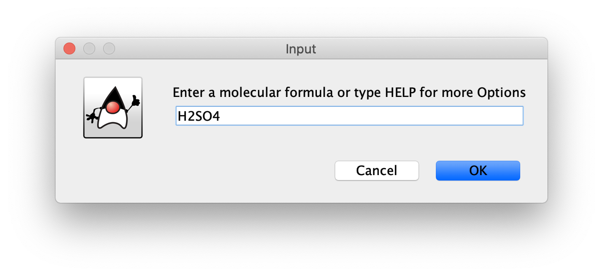
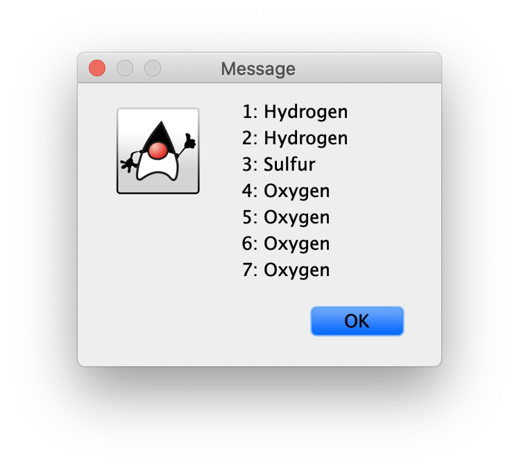
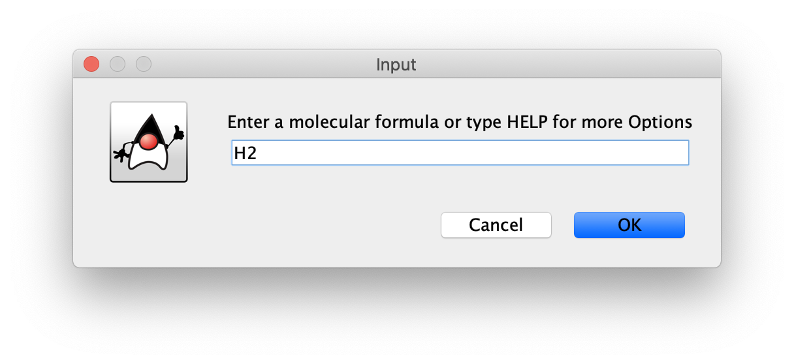

# Molecular Modelling (WIP)
Java/Processing 3 application that simulates interaction between atoms in a molecule


## This program is divided into seven different classes:

### The Nucleus Class:

```Java
class Nucleus { 
  int AtomicNumber;
  String symbol, name;
  double AtomicWeight, mass;
  int numberOfProtons, numberOfElectrons;
  double radius;
  double electronegativity, firstIonizationEnergy;
  int[] oxidationStates;
  int[] RGB;
}
```

This class handles initializing the properties of each atom object

### The Electron Class:

```Java
class Electron {
  int n, l, m, s;
  
  void returnQuantumNumbers(); 
}
```

This class handles initializing the properties of each electron ojbect and can return the values

### The Atom Class:

```Java
class Atom extends Nucleus {
  HashMap<String, List<Electron>> Quantum;
  int charge;
  int numberOfElectrons;
  int energyLevels;
  int x, y, z;
  
  void setUpOrbitals();
  void returnOrbital();
  String[] returnProperties();
  int getValanceElectrons();
}
```

This class joins the nucleus and electron classes together to make an Atom object. The class also holds the `x, y, z` positions of the atom for when modelling them in 3-Dimensional space

### The Bond Class:

```Java
class Bond {
  Atom atom1, atom2;
  int numberOfBonds;
  
  void addBond();
  double getBondPolarity();
}
```

This class is responsible for creating the bond information between two atoms

### The Molecule Class:

```Java
class Molecule {
  ArrayList<Atom> atoms;
  String[] atomNames;
  
  void dissectMolecule(String molecule);
  int findAtomicNumber(String AtomicSymbol);
  public String[] getAtoms();
}
```

This class is responsible for dissecting the user's input molecule and breaking each character into a separate atom object with the method `dissectMolecule(String molecule)`. With each atomic symbol broken down, the atomic number can be found with `findAtomicNumber(String AtomicSymbol)`.

### The Startup Class:

```Java
class Startup {
  void startupWindow();
}
```

This class contains all of the methods that displays the menus and grabs user input





### The Environment Class:

```Java
class Environment extends PApplet {
  void setup();
  void draw();
}
```

This class uses the library processing and peasy cam to 3-D model 




